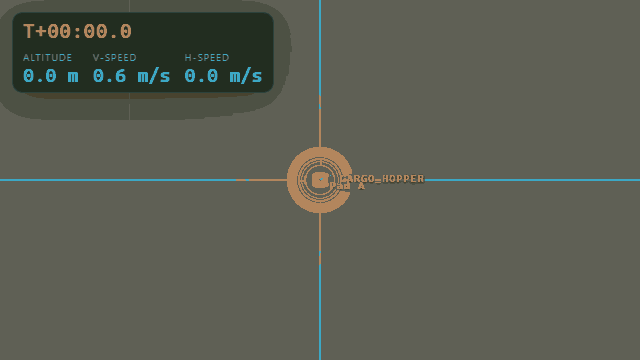
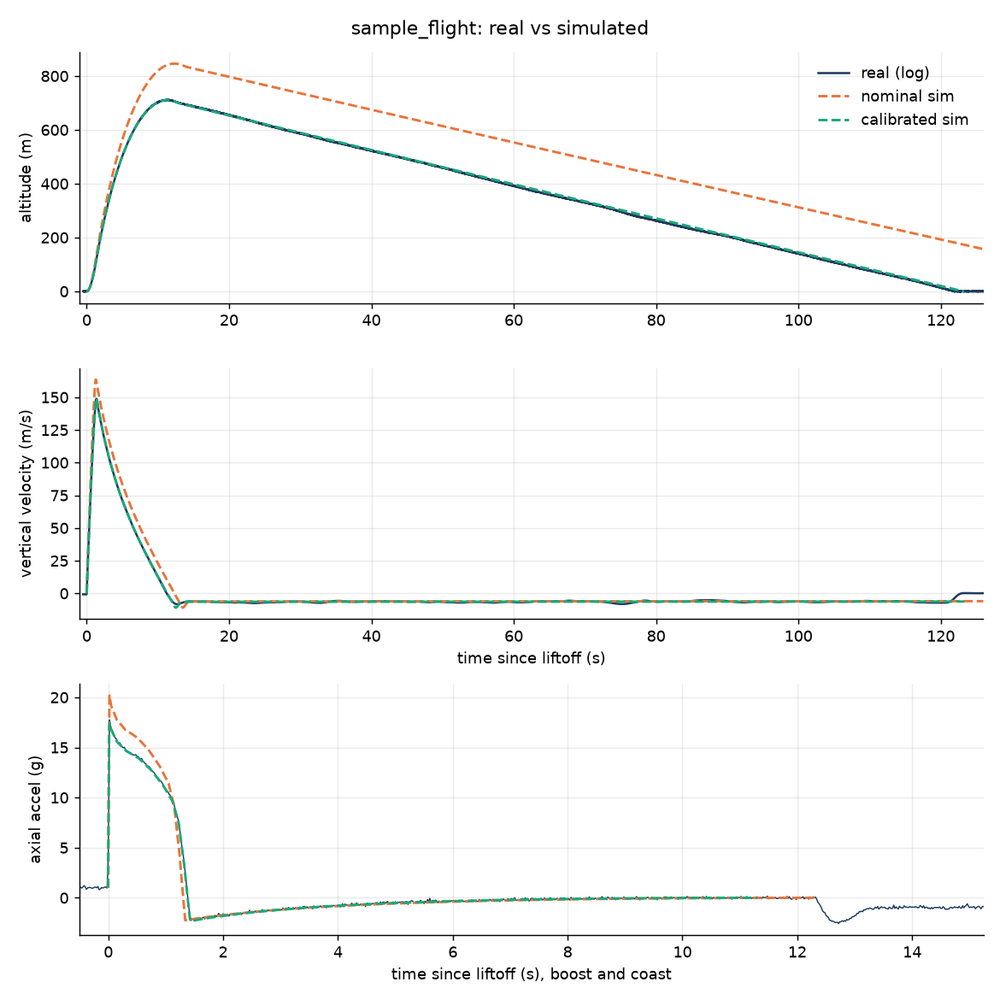
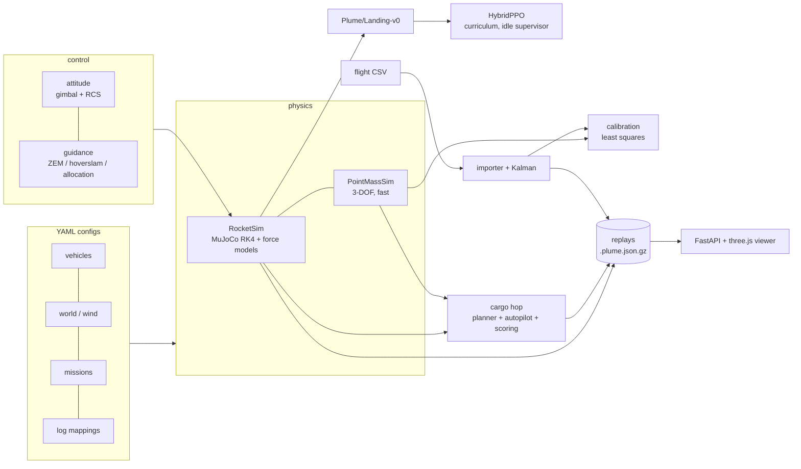

<h1 align="center">🚀 Plume</h1>

<p align="center">
  <b>An open-source 6-DOF simulator for reusable cargo rockets</b><br>
  powered landing · reinforcement learning · 750 km point-to-point cargo hops · sim-to-real calibration from hobby flight logs
</p>

<p align="center">
  <a href="https://github.com/plume-sim/plume/actions"></a>
  
  
  
</p>

<p align="center">
  
  
</p>
<p align="center">
  
  
</p>

Plume flies a rigid-body rocket in MuJoCo with its own gravity, atmosphere, thrust,
gimbal, RCS, aerodynamics, wind and parachute models. It learns to land with PPO, flies
cargo 750 km across 3-D terrain and lands it on rough ground, and fits its drag and
thrust models to real hobby-rocket flight logs. All of it plays back in a browser viewer.

```bash
uv sync --all-extras          # Python 3.11+, CUDA torch on Windows/Linux
uv run plume hop demo_hop     # 750 km cargo hop  -> runs/hop_demo_hop.plume.json.gz
uv run plume viz              # open http://localhost:8765 and pick the replay
```

---

## Contents

- [What's inside](#whats-inside)
- [Quick tour](#quick-tour)
- [Results: PID vs RL](#results-pid-vs-rl)
- [Physics model](#physics-model)
- [Idle-aware training](#idle-aware-training)
- [Configuration](#configuration)
- [Architecture](#architecture)
- [Limitations](#limitations)

## What's inside

| | |
|---|---|
| **6-DOF physics core** | MuJoCo rigid body (RK4, 200 Hz) with Plume force models: flat or spherical gravity, U.S. Standard Atmosphere 1976, throttleable liquid engines (Isp vs. back-pressure, throttle lag, ignition limits) and solid thrust curves (RASP `.eng`), two-axis gimbal, cold-gas RCS with duty-cycle allocation, slender-body strip-theory aero plus fins, wind shear, turbulence and gusts, parachutes, launch rail. Propellant depletes mid-step (2nd-order accurate) and moves the CG. |
| **Validated** | Conservation tests: mechanical energy (10⁻⁶), linear and angular momentum, mass and total impulse (exact), Tsiolkovsky Δv (10⁻⁴), drag work, variable-mass work-energy. Atmosphere is checked against the 1976 tables, and 3-DOF against 6-DOF. |
| **Landing environment** | `Plume/Landing-v0` (Gymnasium) with a four-stage curriculum: 30 m drops up to 4 km descents at terminal velocity in gusty wind. |
| **Guidance autopilot** | Hoverslam stopping profile, ZEM guidance, aero-aware thrust and attitude allocation with gimbal/RCS trim limits, wind-forecast disturbance observer, rate-limited cascaded attitude control. |
| **PPO agent** | Stable-Baselines3 with a hybrid CPU-rollout / CUDA-update PPO and a multi-env subprocess VecEnv (~5k steps/s on 8 cores). Resumable, curriculum-promoting, and idle-aware: it pauses while you game. |
| **Cargo hops** | Point-to-point missions over heightmap terrain on a curved Earth. Ascent planning, kick-and-hold gravity turn, MECO from a drag- and wind-aware impact predictor, steered entry burn, aero descent, landing on unprepared ground (MuJoCo heightfields with rocks). Scored on accuracy, fuel, cargo g-load and time. |
| **Real flight data** | Import any hobby flight-computer CSV through a YAML column mapping. A Kalman/RTS filter fuses baro and accelerometer, and least squares fits drag, motor impulse, burn time and parachute size. Overlay plots, calibrated vehicle YAML. |
| **Viewer** | Three.js in the browser, no build step. Rocket with gimballing engine and plume shader, terrain, trails, pads/targets, live telemetry, replay scrubbing, chase/ground/top/free cameras, live streaming from running sims, side-by-side real vs sim. |

## Quick tour

### 1 · Scripted flights in the physics core

```bash
uv run plume info lander_small                         # derived mass, T/W, delta-v
uv run plume sim lander_small --script hop_test        # lift off, translate 60 m, land
uv run plume sim lander_small --script hop_test --wind 8 --gusts 5 --live   # watch it live in `plume viz`
```

### 2 · Powered landing: PID/guidance vs PPO

```bash
uv run plume land --controller pid --stage full_descent --seed 3       # one episode -> replay
uv run plume train --when-idle                                         # curriculum PPO, pauses for games
uv run plume train --status                                            # progress, stage, why it is paused
uv run plume land --controller ppo --stage full_descent
uv run plume bench                                                     # results table below
```

The agent outputs **throttle and a thrust-axis tilt**. The same attitude controller that
serves the PID baseline turns that into gimbal and RCS commands, so the two controllers
differ only in their guidance. (`action_mode: direct` hands raw gimbal and RCS to the agent.)

### 3 · Cargo hop: 250 kg over 749.5 km

```bash
uv run plume hop demo_hop
```

```
                     demo_hop: Pad A -> Site B
 result           | landed on target
 landing error    | 3.1 m (radius 50 m)
 fuel used / left | 6,718 / 82 kg
 max cargo load   | 5.56 g (limit 6 g)
 flight time      | 8.7 min
 apogee           | 160 km
 touchdown        | 0.68 m/s down, 0.58 m/s across, 0.5 deg slope
```

The flight plan: rise, pitch kick, kick-and-hold, then gravity turn. MECO comes when the
predicted impact point (drag, forecast wind and the planned entry burn all included)
reaches the target. The vehicle then flips engine-first and runs a g-limited entry burn,
steered and extended to null the predicted miss. Engine off through the aero descent,
then a hoverslam landing burn onto a rocky, sloping landing zone. Try
`--cargo 400`, or edit `configs/missions/demo_hop.yaml` (sites, wind, g-limit, target
radius, scoring weights).

<p align="center"></p>

### 4 · Real flight data and sim-to-real calibration

```bash
uv run plume import-log data/flights/sample_flight.csv --mapping generic_altimeter
uv run plume calibrate data/flights/sample_flight.csv --mapping generic_altimeter
```

The bundled sample logs are synthetic "real" flights. A *6-DOF* truth model flew them
with a different drag, a weaker, longer motor burn and a smaller parachute, on a rail in
gusty wind, through noisy, biased, quantised sensors. Fitting the *3-DOF* model recovers
the truth:

| parameter | truth | flight A (ms/ft/g + GPS) | flight B (s/m/m·s⁻² CSV) |
|---|---:|---:|---:|
| drag scale | 1.22 | 1.25 | 1.23 |
| total impulse scale | 0.94 | 0.937 | 0.942 |
| burn-time scale | 1.07 | 1.069 | 1.073 |
| parachute Cd·A (m²) | 0.47 | 0.49 | 0.47 |
| **apogee error** | | **+134 m → −1.4 m** | **+124 m → −0.7 m** |

<p align="center"></p>

For your own logger, copy `configs/flightlogs/generic_altimeter.yaml` and set the column
names and units (`ms`/`s`, `ft`/`m`, `g`/`m/s2`, `deg/s`/`rad/s`, raw or gravity-removed
accelerometer, optional gyro and GPS). Then open both replays side by side in the viewer:
`?compare=real_<log>.plume.json.gz,sim_<log>.plume.json.gz`.

### 5 · Viewer

`uv run plume viz` serves every replay under `runs/` and `data/replays/`.

| key | action |
|---|---|
| Space, ← → | play/pause, step (Shift: 1 s) |
| 1 2 3 4 | chase, ground, top-down, free camera |
| C / L | compare two flights / live stream |
| `[` `]` | playback speed (0.25× to 50×) |

The viewer also takes URL parameters: `?replay=`, `?compare=a,b`, `?camera=`, `?t=`, and
`?capture=1` for frame-exact GIF capture (`scripts/make_gifs.py`).

## Results: PID vs RL

<!-- RESULTS:START -->
_200 seeded episodes per stage and controller; ± is the 95% interval. Fuel, error and touchdown speed are averaged over successful landings._

| Stage | Controller | Success rate | Fuel used (kg) | Landing error (m) | Touchdown speed (m/s) |
|---|---|---:|---:|---:|---:|
| hop_drop | PID / guidance | **100%** ± 0 | 47.4 | 2.36 | 0.79 |
| low_descent | PID / guidance | **94%** ± 3 | 98.5 | 3.84 | 0.75 |
| mid_descent | PID / guidance | **86%** ± 5 | 163.4 | 2.97 | 0.75 |
| full_descent | PID / guidance | **42%** ± 7 | 227.9 | 3.71 | 0.77 |
<!-- RESULTS:END -->

The stages run from a 30–80 m drop to a 2.5–4 km descent at 110–170 m/s with 2–10 m/s
wind, gusts and turbulence. A landing counts only if the vehicle touches down under
2 m/s vertical and 1 m/s horizontal, comes to rest upright (< 10°) and is inside the
10 m pad.

> **PPO rows:** they appear here once the curriculum agent has trained. The idle-aware
> trainer (`plume train --when-idle`) reruns this benchmark and rewrites the table when
> it reaches its 50M-step budget. `plume bench` regenerates it at any point from the
> latest checkpoint. The PID baseline's weak spot is the full descent: without grid fins
> its sideways authority at high dynamic pressure is small, and most failures are pad
> misses after gusts.

## Physics model

Each 200 Hz step: engine and RCS state advance → the mass, CG and inertia of the welded
"wet" body are set to their **mid-step** values (keeping the dry body's frame fixed keeps
MuJoCo's collision bounding volumes valid) → gravity (at the mid-step position), thrust,
RCS, aero, parachute and wind forces are applied through `xfrc_applied` → `mj_step`
(RK4) → propellant is depleted.

- **Aerodynamics**: axial force from Mach tables (separate nose-first and engine-first),
  plus crossflow drag integrated over strips along the hull. Each strip sees its own
  `ω × r` velocity, so centre-of-pressure moments and pitch damping come out without
  extra coefficients, and the model can only remove energy. Fins add a linear normal force.
- **Engine**: thrust `= ṁ·Isp_vac·g0 − p_amb·A_e` (exit area from the sea-level Isp),
  first-order throttle lag, gimbal angle/rate limits, finite ignitions.
- **Curved Earth** (hops): non-rotating inverse-square gravity in a tangent frame at the
  launch site; terrain heights sit above the sphere through an azimuthal-equidistant map;
  forecast wind is rotated into the local horizontal.

Run `uv run pytest -q -n auto` (~3 min) for the full suite. It covers conservation laws,
models, the environment, autopilot, multiprocessing VecEnv, PPO resume/stop, idle
detection, missions (including the full 750 km hop), flight-data import and calibration,
and the viewer server.

## Idle-aware training

```bash
uv run plume train --when-idle    # leave it running; it trains whenever the PC is idle
uv run plume train --status
```

A light supervisor polls every 5 s and **pauses** training when:

- a Steam game is running (it reads `RunningAppID` from the registry and also checks for
  processes under any `steamapps/common`), or
- other processes keep the GPU above 50% for 20 s (NVML, per process; training's own
  processes are excluded), or
- a process on your blocklist is running (`configs/rl/idle_trainer.yaml`).

Pausing checkpoints the model and exits the worker, which frees VRAM and CPU. Training
resumes after 5 idle minutes and accumulates toward 50M steps across sessions. When it
finishes, it writes the benchmark into this README. To start it automatically at logon,
run `scripts/install_idle_trainer.ps1` (`-Remove` uninstalls it).

## Configuration

Everything is YAML with strict validation, so typos are errors. A vehicle looks like this:

```yaml
name: lander_small
geometry: {length: 10.0, diameter: 1.2, nose_length: 1.2}
legs: {count: 4, span: 2.2, height: 1.0, max_touchdown_speed: 5.0}
mass: {dry: 1300.0, dry_cg_z: 3.0}
tanks:
  - {name: main, capacity: 1000.0, z_bottom: 1.2, z_top: 6.5, radius: 0.55}
engine: {type: liquid, thrust_vac: 40000, isp_vac: 300, isp_sl: 275,
         throttle_min: 0.3, gimbal_max_deg: 8, gimbal_rate_deg_s: 25}
rcs: {thrust: 300, isp: 70, propellant: 25, z: 8.5, pods: 4}
aero: {stations: 10}      # Mach tables have sensible defaults
```

| preset | what |
|---|---|
| `configs/vehicles/lander_small.yaml` | 2.3 t VTVL test lander used for the landing task |
| `configs/vehicles/cargo_hopper.yaml` | 8.3 t reusable cargo hopper: 250 kg over ~750 km |
| `configs/vehicles/hobby_rocket.yaml` | 66 mm three-fin rocket on a 29 mm H motor with a parachute |
| `configs/envs/{landing,curriculum}.yaml` | reward weights, success criteria, curriculum stages |
| `configs/missions/demo_hop.yaml` | sites, terrain, wind, guidance limits, scoring |
| `configs/flightlogs/*.yaml` | CSV column mappings |
| `configs/rl/{ppo_landing,idle_trainer}.yaml` | PPO hyperparameters, idle rules |

Terrain is a 16-bit PNG (or `.npy`) plus a small YAML file giving its extent. Regenerate
the bundled maps with `scripts/generate_terrain.py`.

## Architecture



```
src/plume/
  physics/     sim (6-DOF), pointmass (3-DOF), aero, propulsion, atmosphere, gravity, wind, recovery, mjcf
  control/     attitude, guidance, autopilot (landing)
  envs/        landing_env (Gymnasium)          rl/   train, hybrid_ppo, multivec, idle, evaluate, benchmark
  missions/    hop, targeting, scoring          flightdata/   importer, compare, calibrate
  terrain/     heightmaps + procedural maps      recording/    recorder + replay JSON schema
  viz/         FastAPI server + static three.js viewer
```

## Limitations

- Non-rotating Earth. No aerothermal heating or structural loads, and no propellant slosh or jet damping.
- Aero is slender-body strip theory with Mach tables, not CFD. There are no grid fins, so
  high-dynamic-pressure steering on the finless vehicles is weak, as it would be in reality.
- Calibration fits a vertical 3-DOF model, so a strongly weather-cocked or non-vertical
  flight is absorbed into the drag scale. The reported ± values are statistical and don't
  include model error.
- The cargo-hopper and hobby-motor presets are representative, not models of specific
  commercial products.

## Contributing

PRs welcome. See [CONTRIBUTING.md](CONTRIBUTING.md). Plume is MIT-licensed, and the
vendored three.js and uPlot are MIT too.
