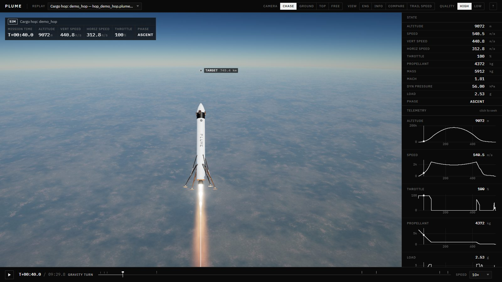
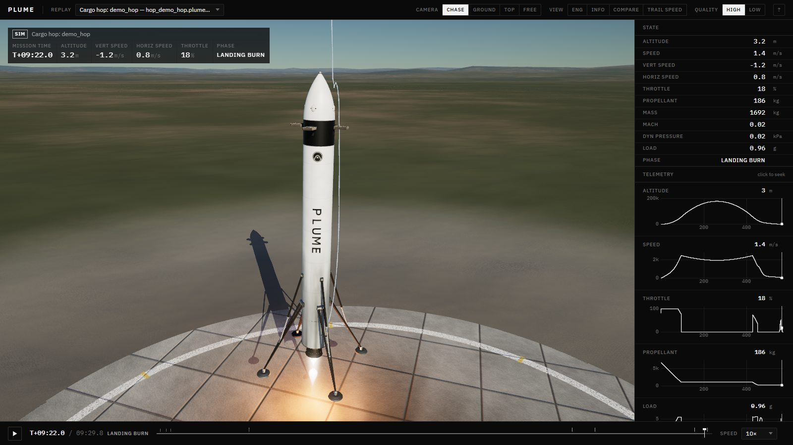
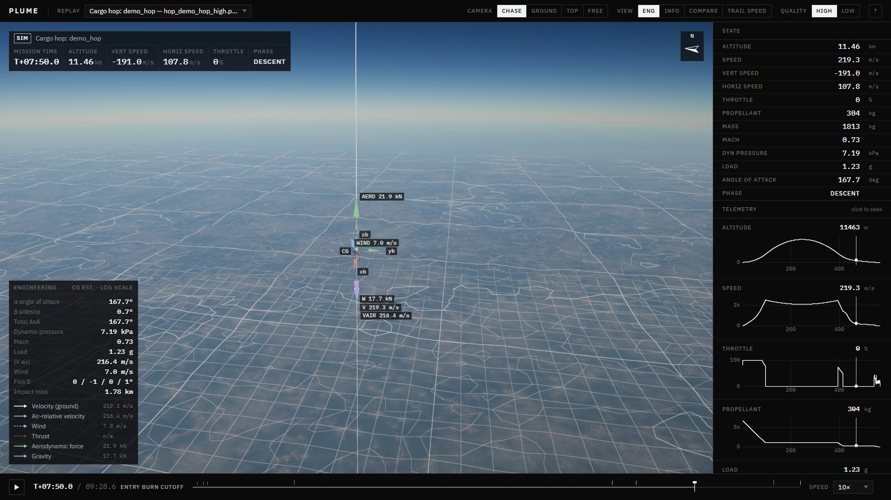
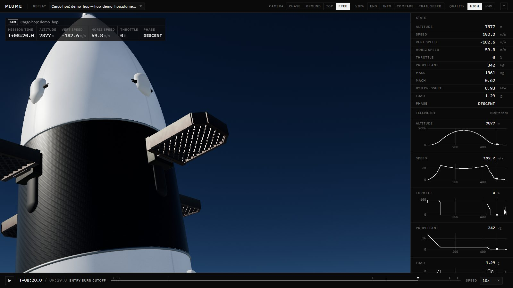
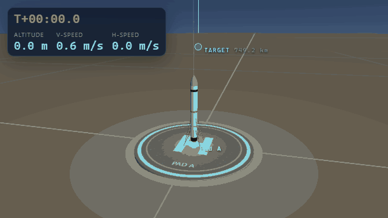
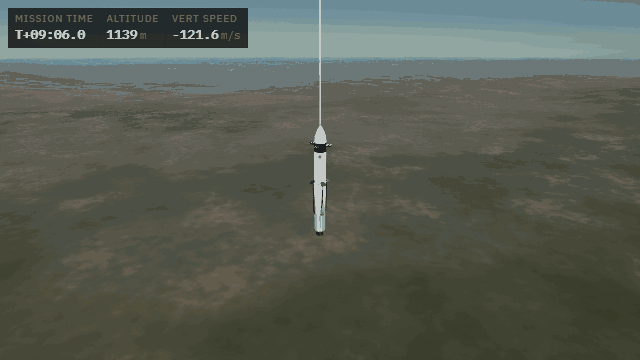
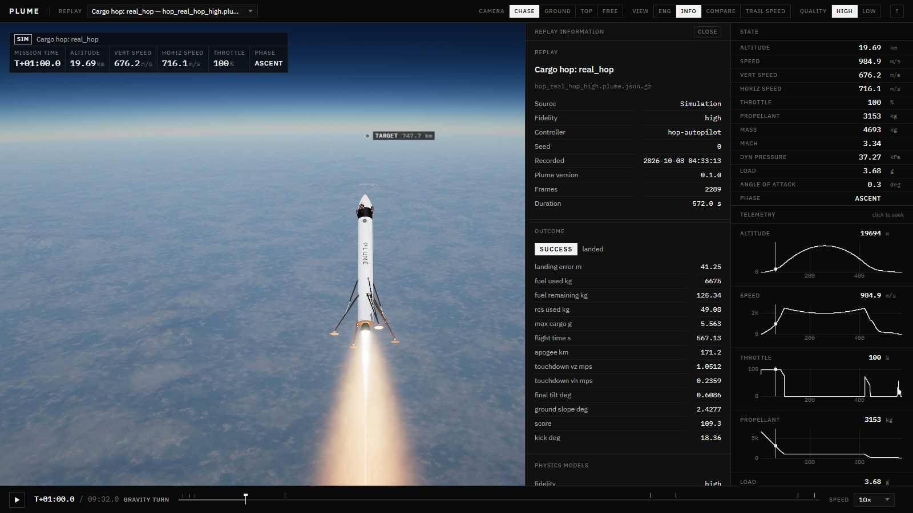
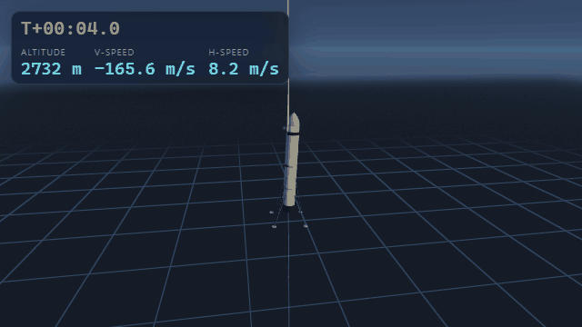
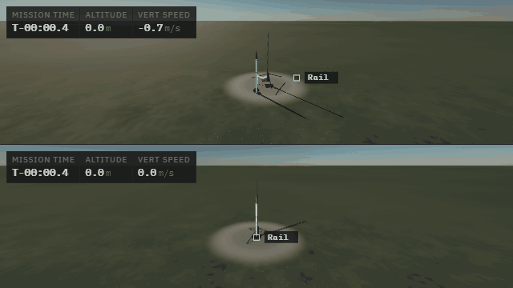
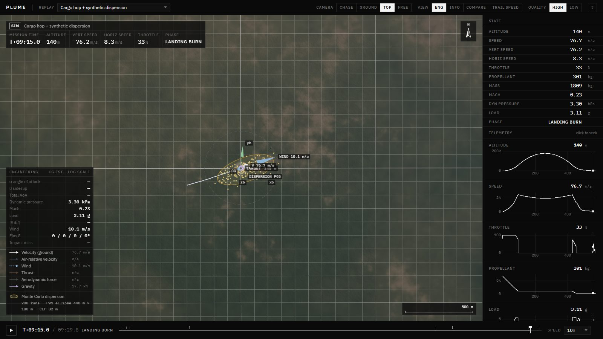

<h1 align="center">Plume</h1>

<p align="center">
  <b>An open-source 6-DOF simulator for reusable cargo rockets, built to be checked</b><br>
  verified physics · fidelity levels · Monte Carlo dependability · real terrain · powered landing and RL · sim-to-real calibration
</p>

<p align="center">
  <a href="https://github.com/plume-sim/plume/actions"></a>
  
  
  
  
</p>

<p align="center">
  
  
</p>
<p align="center">
  
  
</p>

Plume flies a rigid-body rocket in MuJoCo with its own models of:

- Earth and gravity
- atmosphere, wind and turbulence
- aerodynamics
- propulsion, actuators and sensors

It flies cargo 750 km between real launch sites over real terrain and lands it. Every result comes with evidence for how far it can be trusted.

```bash
uv sync --all-extras                       # Python 3.11+, CUDA torch on Windows/Linux
uv run plume hop demo_hop                  # 750 km cargo hop, fast fidelity (~1 min)
uv run plume hop real_hop --fidelity high  # Spaceport America -> Burns Flat, verification-grade models (~5 min)
uv run plume mc real_hop --runs 64         # Monte Carlo at high fidelity: success probability, dispersion, sensitivity
uv run plume vv-report                     # verification report: tests, NASA check cases, model status
uv run plume viz                           # viewer at http://localhost:8765
```

---

## Contents

- [Dependable, not just realistic](#dependable-not-just-realistic)
- [What's inside](#whats-inside)
- [Quick tour](#quick-tour)
- [Monte Carlo: how dependable is the cargo hop?](#monte-carlo-how-dependable-is-the-cargo-hop)
- [Results: PID vs RL](#results-pid-vs-rl)
- [Physics models](#physics-models)
- [Idle-aware training](#idle-aware-training)
- [Configuration](#configuration)
- [Architecture](#architecture)
- [Limitations](#limitations)

## Dependable, not just realistic

No simulator is "the most realistic possible", and realism alone doesn't make results dependable. Plume rests on three separate kinds of evidence:

| | What it answers | Status |
|---|---|---|
| **Verification** | Is the math implemented correctly? | 139 automated checks: analytic orbits, energy integrals, convergence, published tables, NASA reference trajectories. `plume vv-report` writes [docs/vv/report.html](docs/vv/report.html). |
| **Validation** | Do the models match reality? | **Pending real data.** The pipeline is ready: flight-log import, calibration, and aero database importers for RASAero, OpenRocket, DATCOM and CSV. No model is marked validated until real flight or test data has been compared. |
| **Quantified uncertainty** | How likely is the mission to succeed? | `plume mc` samples engine, mass, aero, actuator and weather uncertainty. It reports success probability with a confidence interval, the landing dispersion, failure modes and the parameters that drive misses. |

Key verification results:

- **NASA NESC atmospheric check cases 1–10** (NASA/TM-2015-218675) all pass against the published reference trajectories of NASA's own simulation tools. The cases include a dropped sphere on a rotating WGS-84 Earth with J2, drag and wind, a tumbling brick, and a cannonball. Errors are about 0.1–0.2 of the allowed tolerance, which is twice the spread between the NASA tools.
- **High-fidelity integration** evaluates every force at each RK4 stage. It converges at second order or better, and the default 5 ms step is within 1 cm of the converged answer after 30 s of tumbling flight.
- **Environment:** U.S. Standard Atmosphere 1976 to 1000 km and the NRLMSISE-00 reference case are reproduced. MIL-F-8785C turbulence matches its variance and correlation targets.
- **Aerodynamic database:** generated coefficients are checked against digitised NASA wind-tunnel data (TN D-6996). Normal-force rms error is 11 % at angles of attack of 15–105°; details are in [docs/models/aero.md](docs/models/aero.md).

### Fidelity levels

| | `fast` (default) | `high` |
|---|---|---|
| Earth | flat, or non-rotating sphere | WGS-84 ellipsoid, rotating, J2–J6 gravity |
| Integration | forces held per step | forces re-evaluated at every RK4 stage |
| Atmosphere | US76 | US76 to 1000 km, NRLMSISE-00, or radiosonde soundings |
| Wind | shear, gusts, first-order turbulence | forecast/sounding profiles, MIL-F-8785C Dryden or von Kármán turbulence |
| Aerodynamics | strip theory with Mach tables | 6-component database (Mach, α 0–180°, Reynolds) with grid-fin transonic choking, retro-propulsion and heating; legs stowed in flight |
| Actuators | first-order | second-order gimbal with delay and backlash, ignition delay, RCS pulse-width modulation with minimum impulse bit |
| Propellant | rigid, moves the CG as it drains | same, plus optional first-mode slosh per tank (spring–mass, NASA SP-106) |
| Flight software sees | true state | navigation estimate: IMU, GNSS, baro and radar altimeter fused by a 15-state EKF |
| Speed | RL and fast iteration | about 3–5× slower |

## What's inside

| | |
|---|---|
| **6-DOF physics core** | MuJoCo rigid body (RK4, 200 Hz) with Plume force models: throttleable liquid engines and solid thrust curves, two-axis gimbal, cold-gas RCS, aerodynamics, grid fins, wind, parachutes, launch rail. Propellant depletes mid-step and moves the CG. |
| **Real terrain** | Copernicus DEM GLO-30 (30 m, global, free) fetched and cached with `plume terrain fetch`. Mission sites are given as latitude/longitude, with hazard maps for slope and roughness at landing zones. |
| **Cargo hops** | Point-to-point missions with an ascent planner, gravity turn, MECO from a drag-aware impact predictor, steered entry burn, aero descent with grid fins, and a landing burn on unprepared ground. Missions are scored on accuracy, fuel, cargo g-load and time. Divert-limit logic chooses a safe landing when the pad is out of reach. |
| **Monte Carlo** | Dispersion files, parallel resumable runs (low priority, pausing while you game), Wilson intervals, CEP and 99 % ellipses, Spearman sensitivity, an HTML report, and a dispersion overlay in the viewer. |
| **Landing environment** | `Plume/Landing-v0` (Gymnasium) with a four-stage curriculum, a PID/guidance baseline and PPO (Stable-Baselines3, CUDA). |
| **Real flight data** | Flight-computer CSV import through a YAML column mapping, a Kalman/RTS filter, least-squares calibration of drag, impulse and parachute size, and real-vs-sim overlays. |
| **Viewer** | Monochrome interface with a physically based 3-D scene: HDR, sky scattering, volumetric exhaust with shock diamonds, and procedural models built from the vehicle YAML (lattice grid fins, carbon legs, regeneratively cooled bell). It adds an engineering view, model provenance, live streaming, and a real-vs-sim compare mode. |

## Quick tour

### 1 · Cargo hop: 250 kg over 750 km

```bash
uv run plume hop demo_hop                       # fast fidelity
uv run plume hop real_hop --fidelity high       # real sites and terrain, every high-fidelity model
```

<p align="center">
  
  
</p>

`real_hop` flies from Spaceport America, New Mexico, to Burns Flat, Oklahoma: 761 km on Copernicus terrain. The world frame is East-North-Up at the pad on a rotating WGS-84 Earth. The flight software flies on its navigation estimate (EKF position error up to 3–5 m). Planning uses the nominal vehicle and the forecast wind, while the simulator flies the truth.

```bash
uv run plume terrain fetch --site 32.990,-106.986 --site2 35.335,-99.225 --radius-km 60 --resolution 500 --out data/terrain/my_route.yaml
```

<p align="center"></p>

### 2 · Dependability analysis

```bash
uv run plume mc real_hop --runs 64 --workers 8  # high fidelity, about 45 min on 8 cores; docs/mc/real_hop_high.html
uv run plume mc demo_hop --workers 8            # fast screening, 200 runs
uv run plume vv-report                          # docs/vv/report.html
```

### 3 · Powered landing: PID/guidance vs PPO

```bash
uv run plume land --controller pid --stage full_descent --seed 3
uv run plume train --when-idle                  # curriculum PPO, pauses for games and heavy GPU use
uv run plume bench
```

<p align="center"></p>

### 4 · Real flight data and sim-to-real calibration

```bash
uv run plume import-log data/flights/sample_flight.csv --mapping generic_altimeter
uv run plume calibrate data/flights/sample_flight.csv --mapping generic_altimeter
```

<p align="center"></p>

The bundled logs are synthetic "real" flights. A 6-DOF truth model with different drag, motor and parachute flew them through noisy, biased sensors. Calibration recovers the truth to within 1–3 % and cuts the apogee error from +134 m to −1.4 m.

### 5 · Viewer

`uv run plume viz` serves every replay under `runs/` and `data/replays/`.

| key | action |
|---|---|
| Space, ← → | play/pause, step |
| 1 2 3 4 | chase, ground, top-down, free camera |
| E | engineering view: force and velocity vectors, α/β, q, Mach, predicted impact, dispersion ellipse |
| I | replay information: fidelity, models, outcome |
| Q | rendering quality |
| C / L | compare two flights / live stream |

## Monte Carlo: how dependable is the cargo hop?

**Real route, high fidelity:** Spaceport America → Burns Flat, 761 km, 250 kg cargo, 64 runs (`plume mc real_hop`).

The run uses the full high-fidelity stack:
- rotating WGS-84 Earth, NRLMSISE-00 and von Kármán turbulence
- the aerodynamic database
- actuator dynamics
- flight software flying on its EKF estimate

<!-- MC:START -->
| | result (95 % CI) |
|---|---:|
| **mission success** (cargo inside the 50 m target) | **87.5 %** (77.2–93.5 %) |
| vehicle recovered intact | 93.8 % (85.0–97.5 %) |
| CEP50 / CEP90 | 5 m / 28 m |
| propellant left, p5 / median | 85 / 133 kg |
| peak cargo load, median / p95 | 5.97 / 6.28 g (limit 6 g) |
| failures | 4 off-target landings, 3 terrain impacts, 1 tip-over |

_Report: [docs/mc/real_hop_high.html](docs/mc/real_hop_high.html). The dispersions in `configs/dispersions/real_hop.yaml`:_
- _engine: thrust 1.5 %, Isp 0.5 %, misalignment 0.15°, throttle lag_
- _mass: dry mass 1 %, CG 5 cm, cargo 2 %_
- _aero: axial force 10 %, grid fins 15 %_
- _RCS: 5 %_
- _weather: wind 2.5 m/s and 30° error against the forecast, gusts up to 6 m/s, temperature ±6 K, solar activity, light or moderate turbulence_
<!-- MC:END -->

<p align="center"></p>

**How the guidance got there:** each version was measured on the same seeded draws, and each fix came from a Monte Carlo finding.

| version | change | high-fidelity success |
|---|---|---:|
| v4 | baseline: hoverslam landing, open-loop gravity turn, subsonic-only steering | 22 % (14 / 64) |
| v6 | closed-loop ascent (track the planned flight-path angle); descent steering asks for a *change* from the natural aero force; supersonic steering where the aero database shows strong, consistent authority | **87.5 % (56 / 64)** |

What the analysis still shows (details in [docs/models/guidance.md](docs/models/guidance.md)):

- **Wind speed** is the dominant driver of miss distance (Spearman ρ = 0.78). Temperature (−0.32), dry mass (−0.30) and throttle lag (−0.26) follow.
- **Cargo g-limit:** the median run peaks at 5.97 g, and 5 % exceed 6.28 g. The peak happens during the *unpowered* descent, at about 31 kPa of drag after the entry burn, so no throttle logic can limit it. Lowering `entry_speed` reduces peak deceleration roughly as speed squared (about 1400 → 1300 m/s for −15 %), but costs propellant from a 5th-percentile margin of only 85 kg. That is a design trade to decide on, not a tuning fix.
- **Ascent loss of control at max-q** caused all 3 catastrophic failures: a gust at about 50 kPa saturates the 7° gimbal on the aerodynamically unstable hull. A 9° gimbal saves 2 of the 3; load relief and a throttle bucket did not help. This is a vehicle design item (thrust-vector authority, max-q, ascent stability).
- **Propellant:** the worst 5 % land with under 85 kg.
- **Fast fidelity is not a dependability tool for this vehicle.** Strip theory gives a sign-flipping side force when the engine-first body tilts. With the same guidance, the fast campaign scores 12.5 % success over 200 runs, 81.5 % recovery and a 257 m CEP50 ([report](docs/mc/demo_hop_fast.html)). Quote high-fidelity campaigns.

## Results: PID vs RL

<!-- RESULTS:START -->
_200 seeded episodes per stage and controller; ± is the 95% interval. Fuel, error and touchdown speed are averaged over successful landings._

| Stage | Controller | Success rate | Fuel used (kg) | Landing error (m) | Touchdown speed (m/s) |
|---|---|---:|---:|---:|---:|
| hop_drop | PID / guidance | **100%** ± 0 | 47.4 | 2.35 | 0.79 |
| low_descent | PID / guidance | **96%** ± 3 | 98.3 | 3.73 | 0.75 |
| mid_descent | PID / guidance | **90%** ± 4 | 163.6 | 2.98 | 0.75 |
| full_descent | PID / guidance | **50%** ± 7 | 229.0 | 3.32 | 0.76 |
<!-- RESULTS:END -->

The stages run from a 30–80 m drop to a 2.5–4 km descent at 110–170 m/s in 2–10 m/s wind with gusts. A landing counts if touchdown is under 2 m/s vertical and 1 m/s horizontal, the vehicle comes to rest upright, and it is inside the 10 m pad. PPO rows appear once the idle-aware trainer has finished its 50M-step curriculum; `plume bench` regenerates the table.

At high fidelity (`plume land --fidelity high`) the same PID baseline does better on the mid descent (20/20 vs 16/20 in a 20-episode check) and much worse on the full descent (2/20 with 6 leg crashes vs 7/20). The finless lander is statically unstable when flying engine-first under the database aerodynamics, and the gimbal actuator lag makes that harder to control. Results from the fast model alone would overstate this controller.

## Physics models

Each model has a page in [docs/models/](docs/models/README.md) covering its equations, sources, assumptions, validity range, uncertainty and verification status:

| model | page |
|---|---|
| Earth, frames, gravity, rotating-frame dynamics, integration | [earth.md](docs/models/earth.md) |
| Atmosphere, soundings, wind, MIL-F-8785C turbulence | [atmosphere.md](docs/models/atmosphere.md) |
| Aerodynamic database and generator | [aero.md](docs/models/aero.md) |
| Propulsion and actuators | [propulsion.md](docs/models/propulsion.md) |
| Mass properties | [mass.md](docs/models/mass.md) |
| Propellant slosh | [slosh.md](docs/models/slosh.md) |
| Sensors and navigation | [navigation.md](docs/models/navigation.md) |
| Real terrain | [terrain.md](docs/models/terrain.md) |
| Cargo-hop guidance, plus Monte Carlo findings | [guidance.md](docs/models/guidance.md) |

`uv run pytest -q -n auto` runs the full suite (about 4 min), and `uv run pytest -m vv` runs the verification set.

## Idle-aware training

```bash
uv run plume train --when-idle    # trains whenever the PC is idle
uv run plume train --status
```

A light supervisor polls every 5 s and pauses training when:

- a Steam game is running (it reads `RunningAppID` and watches `steamapps/common` processes);
- other processes keep the GPU above 50 % for 20 s;
- a process on your blocklist is running.

Pausing checkpoints the model and frees VRAM; training resumes after 5 idle minutes. Monte Carlo campaigns use the same detector and run at below-normal priority.

## Configuration

Everything is strictly validated YAML. A vehicle looks like this:

```yaml
name: lander_small
geometry: {length: 10.0, diameter: 1.2, nose_length: 1.2}
legs: {count: 4, span: 2.2, height: 1.0, max_touchdown_speed: 5.0}
mass: {dry: 1300.0, dry_cg_z: 3.0}
tanks:
  - {name: main, capacity: 1000.0, z_bottom: 1.2, z_top: 6.5, radius: 0.55}
engine: {type: liquid, thrust_vac: 40000, isp_vac: 300, isp_sl: 275,
         throttle_min: 0.3, gimbal_max_deg: 8, gimbal_rate_deg_s: 25}
rcs: {thrust: 300, isp: 70, propellant: 25, z: 8.5, pods: 4}
aero: {stations: 10}          # model: auto | strip | database
sensors: {imu: {gyro_arw_deg_rt_h: 0.125}, gnss: {sigma_h_m: 1.5}}
```

A world sets the fidelity and environment:

```yaml
world:
  fidelity: high                      # fast | high
  gravity: wgs84                      # flat | spherical | wgs84 (set automatically for high-fidelity missions)
  atmosphere_model: {model: nrlmsise00, epoch: "2025-06-21T15:00:00Z", f107: 150, ap: 4}
  wind: {speed: 5, from_deg: 250, turbulence_severity: light, profile: null}   # profile: sounding CSV
  navigation: auto                    # auto | truth | ekf
```

| preset | what |
|---|---|
| `configs/vehicles/cargo_hopper.yaml` | 8.3 t reusable cargo hopper with grid fins: 250 kg over about 750 km |
| `configs/vehicles/lander_small.yaml` | 2.3 t VTVL test lander for the landing task |
| `configs/vehicles/hobby_rocket.yaml` | 66 mm three-fin rocket on a 29 mm H motor |
| `configs/missions/{demo_hop,real_hop}.yaml` | synthetic-terrain and real-terrain cargo hops |
| `configs/dispersions/*.yaml` | Monte Carlo uncertainty sets |

## Architecture

```
src/plume/
  physics/     sim (6-DOF), pointmass (3-DOF), earth (WGS-84, J2-J6, rotating frame), gravity,
               atmosphere (US76, NRLMSISE-00, soundings), wind, turbulence (MIL-F-8785C),
               aero (strip), aerodb + aero_gen (database, generator, importers), gridfins,
               propulsion (engine, gimbal actuator, RCS PWM), slosh, sensors, recovery, mjcf
  control/     attitude, autopilot (landing), navigation (INS/GNSS EKF)
  missions/    hop (planner, autopilot), targeting (impact prediction), scoring
  analysis/    nasa_checkcases, montecarlo, vv (report)
  terrain/     heightmaps, Copernicus DEM, hazard maps
  envs/ rl/    Gymnasium landing env, hybrid PPO, idle supervisor, benchmark
  flightdata/  importer, Kalman/RTS, calibration
  recording/   replay recorder + JSON schema          viz/   FastAPI + three.js viewer
```

## Limitations

- **Validation:** no model has been validated against real flight data yet, so every model is verified only. Treat absolute results as engineering estimates until logs, CFD or wind-tunnel data are plugged in.
- **Aerodynamics:**
  - Semi-empirical aero is checked only against supersonic (Mach 2.86) body data so far.
  - Subsonic, transonic, finned-body, grid-fin and retro-propulsion data have not been compared yet.
  - There is no aeroelasticity or structural-load model.
- **Vehicle effects not modelled:** structural bending modes, landing-gear crush stroke and soil models. Slosh covers the first mode only. The IMU is assumed at the CG.
- **Navigation:** the onboard terrain map is assumed perfect, and there is no RTK or landing-beacon option.
- **Geoid:** DEM heights are orthometric, the simulator uses ellipsoidal heights, and the geoid offset (tens of metres) is not applied.
- **Flight software:** the cargo-hop guidance reaches 87.5 % success at high fidelity under the stated dispersions. It is not flight-qualified: it exceeds the cargo g-limit slightly, and the dispersion bounds are representative rather than measured.
- **Presets:** the vehicle presets are representative, not models of specific commercial products.

## Contributing

PRs are welcome; see [CONTRIBUTING.md](CONTRIBUTING.md). Plume is MIT-licensed. The vendored three.js and uPlot are MIT, and IBM Plex is under the SIL OFL.
